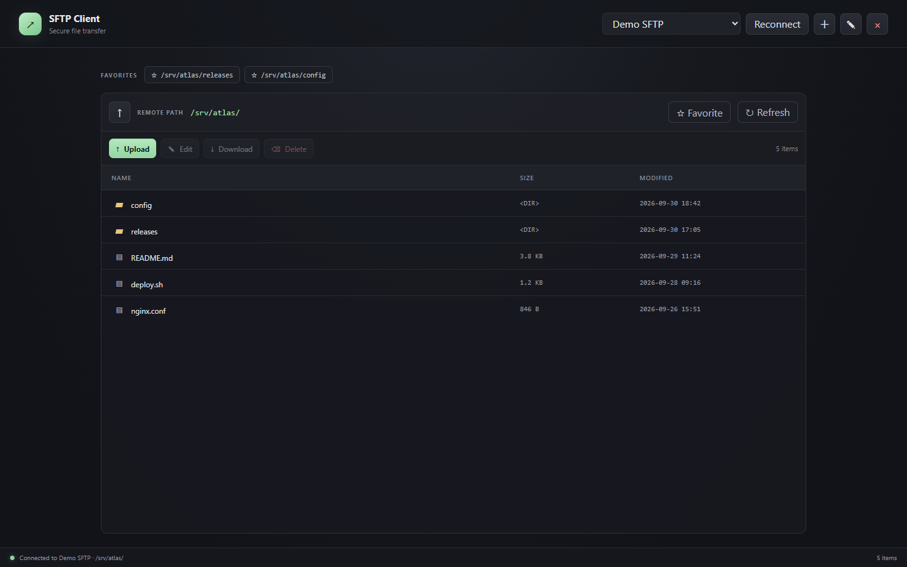

# SFTP Client

A lightweight desktop SFTP client for Windows, macOS, and Linux. Connect to SSH servers, browse remote folders, and transfer files in one app.



## Features

- Save server profiles and reconnect to them later.
- Connect with a password or SSH private key.
- Browse remote folders and favorite frequently used paths.
- Upload and download multiple files.
- Open remote files in a local editor and upload changes.
- Store saved passwords in the operating system credential store.
- Verify SSH host keys when connecting.

## Run from source

Requirements: Node.js 20 or later, npm, and the stable Rust toolchain. Install the native prerequisites for [Tauri 2](https://v2.tauri.app/start/prerequisites/) on your operating system.

```sh
npm ci
npm run tauri dev
```

Build an installable app for the current operating system:

```sh
npm run tauri build
```

## Download a release

Published installers are available on the [GitHub Releases page](https://github.com/uponatime2019/SftpClientTauri/releases). The release workflow builds Windows x64, Linux x64 and ARM64, and macOS Intel and Apple Silicon packages.

macOS builds are ad-hoc signed and are not notarized. macOS may require allowing the app in Privacy & Security.

## Publish a release

Push the code to `main` first, then push a version tag. The `v*` tag starts the GitHub Actions workflow, which builds the platform packages and publishes the release after all builds succeed.

```sh
git push origin main
git tag v0.1.0
git push origin v0.1.0
```

## License

[MIT](LICENSE)
